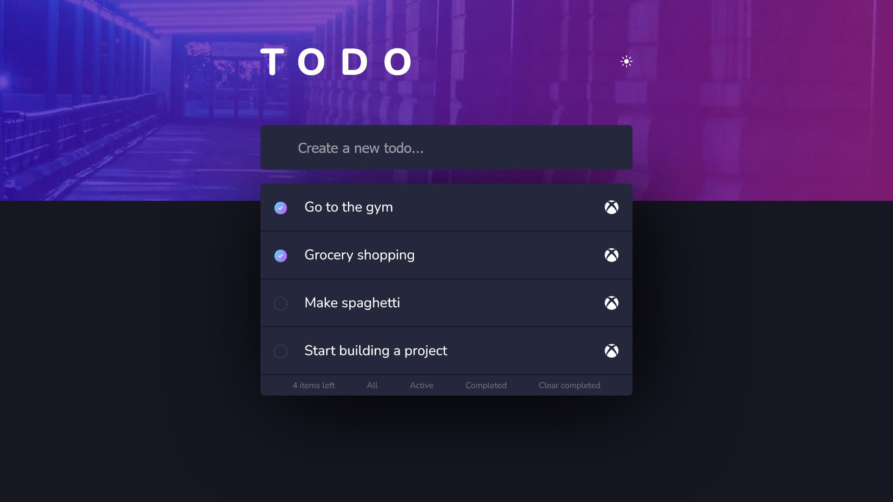
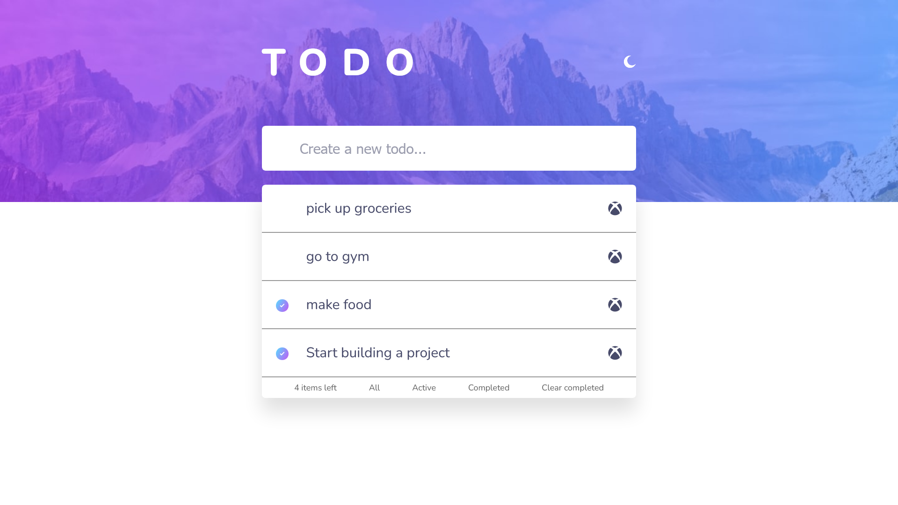
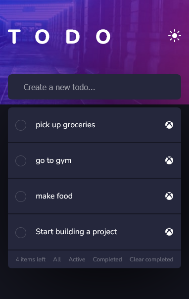
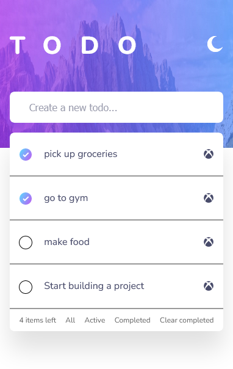

# Todo app

## Table of contents

- [Overview](#overview)
  - [The challenge](#the-challenge)
  - [Screenshot](#screenshot)
  - [Links](#links)
- [My process](#my-process)
  - [Built with](#built-with)
  - [What I learned](#what-i-learned)
- [Acknowledgments](#acknowledgments)

## Overview

I wanted to create a todo app that focuses on functionality which would put my JavaScript skills to the test. Also, I created this page using vanilla HTML,CSS and JS rather than using frameworks because I wanted to aply all my knowledge of these languages and see what i'm capable of.

### The challenge

Users should be able to:

- See hover states for all interactive elements on the page
- Add new todos to the list
- Mark todos as complete
- Delete todos from the list
- Filter by all/active/complete todos
- Clear all completed todos
- Toggle light and dark mode

### Screenshot

Dark-Desktop 
Light-Desktop 

Dark-Mobile 
Light-Mobile 

### Links

- Live Site URL: []

## My process

Started off with structuring the HTML by applying divs, headers, form controls, ul's etc. Put in CSS styles to make the page visually pleasing for the user and to focus on the static sections of the page before moving on to animations, like pseudo-classes and pseudo-elements. 

After structuring and designing the page, I then would focus on JavaScript and functionality. I would use event listeners to be called after an event occurence and would use array methods to check whether each item passed a certain condition. 

Finally, I would created a function that would toggle between light and dark mode for user friendliness.

### Built with

- Semantic HTML5 markup
- CSS custom properties
- Flexbox
- Mobile workflow
- JavaScript
- Array prototypes
- DOM Nodes
- Event listeners

### What I learned

I've learnt that I could convert query selector references to array using Array.from() which allows me to use array methods making it easier to access each item in the todo list.

example: 

Array.from(list.children).forEach(item => {
        if(!item.firstElementChild.firstChild.nextSibling.checked){     
            item.style.display = 'none';
        } else if (item.firstElementChild.firstChild.nextSibling.checked){
            item.style.display = 'flex';
        }
})

## Acknowledgments

I want to tip my hat to Shaun Pelling who has a Udemy Course teaching Modern JavaScript. His lessons have greatly helped improve my JavaScript abilities and program efficiently.